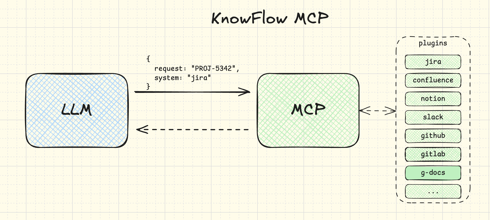

# KnowFlow MCP

[](https://opensource.org/licenses/MIT)

A versatile, unified knowledge retrieval tool operating according to the Model Context Protocol (MCP). KnowFlow enhances Large Language Models by providing structured external knowledge on demand.

## 🚀 Overview

KnowFlow simulates a simplified version of Retrieval-Augmented Generation (RAG), enabling LLMs to dynamically fetch context or domain-specific information from external knowledge bases, resulting in precise, context-aware responses.



### Core Features

- Responds to knowledge retrieval requests from MCP-compatible LLMs
- Performs searches across knowledge sources based on queries received from LLMs
- Provides structured responses with clear source metadata
- Establishes a foundation for integration with multiple knowledge sources

## 📋 Requirements

- Node.js (version 16.x or higher)
- TypeScript (version 4.x or higher)
- npm or yarn

## 🛠️ Installation

```bash
# Clone the repository
git clone https://github.com/esurovtsev/know-flow-mcp.git
cd know-flow-mcp

# Install dependencies
npm install
# or
yarn install
```

## 🔧 Configuration

Create a `.env` file in the root directory with the following configuration:

```
KNOWLEDGE_DIR=./knowledge
```

Where `KNOWLEDGE_DIR` is the path to the directory containing your knowledge base files (`.txt` and `.md` files).

## 🚀 Usage

```bash
# Build the project
npm run build
# or
yarn build

# Start the server
npm start
# or
yarn start
```

## 🔗 MCP Configuration

To use KnowFlow with any MCP-compatible LLMs (such as Claude, GPT-4, etc.), you can use the provided `mcp-config.json` file:

```json
{
  "mcpServers": {
    "knowflow": {
      "command": "node",
      "args": ["dist/index.js"]
    }
  }
}
```

This configuration file tells MCP-compatible LLMs how to start and connect to the KnowFlow MCP server. You would typically place this file in your project directory and reference it when setting up the LLM to use MCP servers.

Note: Once KnowFlow is stable and published to npm, the command will change to `npx know-flow-mcp` instead of `node dist/index.js`.

## 🧪 Testing with MCP Inspector

The [MCP Inspector](https://github.com/modelcontextprotocol/inspector) is a tool that allows you to test your MCP server without needing to integrate with an LLM.

```bash
# Run the Inspector with your MCP server
npx @modelcontextprotocol/inspector node dist/index.js
```

This will start the MCP Inspector web interface (typically at http://127.0.0.1:6274) where you can:

1. View all available tools exposed by the server
2. Test the `search_knowledge` tool by sending requests with different parameters
3. View the responses and debug the communication

If you encounter port conflicts, you can specify custom ports:

```bash
npx @modelcontextprotocol/inspector node dist/index.js --port 8080 --proxy-port 8081
```

Where:
- `--port` specifies the web interface port (default: 6274)
- `--proxy-port` specifies the proxy server port (default: 6277)

### Example Response Format

```json
[
  {
    "source": {
      "location": "local_file",
      "title": "architecture-notes.md"
    },
    "modified": "2024-03-14",
    "snippet": "We agreed to consolidate all backend modules under a single monorepo using Nx."
  }
]
```

## 🧪 Testing

```bash
# Run tests
npm test
# or
yarn test
```

## 📝 API Documentation

*Detailed API documentation will be available once the project reaches a more mature stage.*

## 🗂️ Project Structure

```
know-flow-mcp/
├── src/                # Source code
│   ├── index.ts        # Entry point
│   └── server.ts       # MCP server definition and tool registration
├── dist/               # Compiled JavaScript files
├── .gitignore          # Git ignore file
├── LICENSE             # MIT License
├── package.json        # Project metadata and dependencies
├── README.md           # Project documentation
└── tsconfig.json       # TypeScript configuration
```

## 🔮 Future Roadmap

The foundational design explicitly anticipates integration with additional knowledge sources such as:

- **Notion** pages
- **Confluence** documentation
- **Google Docs** documents
- **Linear and Jira** issues or tickets
- Other popular knowledge repositories utilized by developers and organizations

## 🤝 Contributing

Contributions are welcome! Please feel free to submit a Pull Request.

## 📄 License

This project is licensed under the MIT License - see the [LICENSE](LICENSE) file for details.